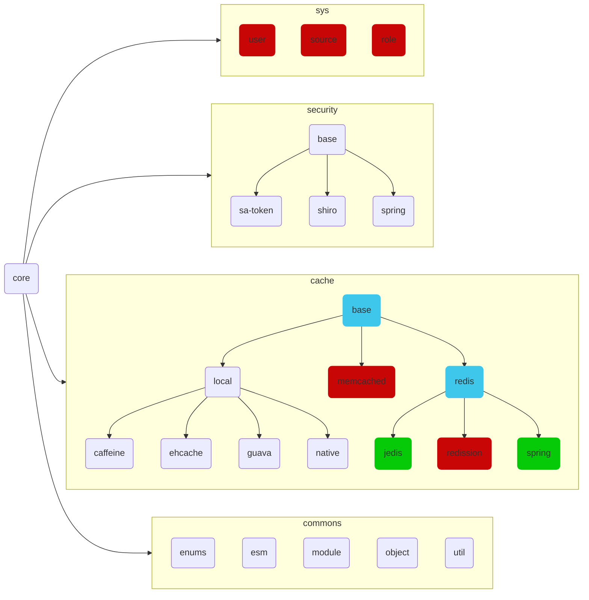

# PISM-hyacinth

适用于中小型项目的快速构建框脚手架

## 脚手架组成

```mermaid
flowchart LR
    classDef done fill: #06c907, stroke: #06c907, stroke-width: 4px;
    classDef inProgress fill: #3ec7ea, stroke: #3ec7ea, stroke-width: 4px;
    classDef todo fill: #c90606, stroke: #c90606, stroke-width: 4px;

    core(core)
    subgraph sys
        user(user)
        source(source)
        role(role)
    end

    core --> sys
    core --> security
    core --> cache
    core --> commons

    subgraph security
        security-base(base)
        security-sa-token(sa-token)
        security-shiro(shiro)
        security-spring(spring)
        security-base --> security-sa-token
        security-base --> security-shiro
        security-base --> security-spring
    end

    subgraph cache
        cache-base(base)
        cache-local(local)
        cache-local-caffeine(caffeine)
        cache-local-ehcache(ehcache)
        cache-local-guava(guava)
        cache-local-native(native)
        cache-base --> cache-local --> cache-local-caffeine & cache-local-ehcache & cache-local-guava & cache-local-native

        cache-memcached(memcached)
        cache-base --> cache-memcached
        
        cache-redis(redis)
        cache-redis-jedis(jedis)
        cache-redis-redission(redission)
        cache-redis-spring(spring)
        cache-base --> cache-redis --> cache-redis-jedis & cache-redis-redission & cache-redis-spring
    end

    subgraph commons
        enums(enums)
        esm(esm)
        module(module)
        object(object)
        util(util)
    end

    user:::todo
    source:::todo
    role:::todo
    cache-base:::inProgress
    cache-memcached:::todo
    cache-redis:::inProgress
    cache-redis-jedis:::done
    cache-redis-redission:::todo
    cache-redis-spring:::done

```